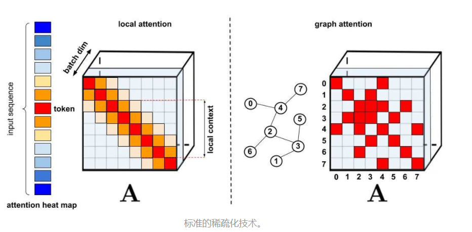
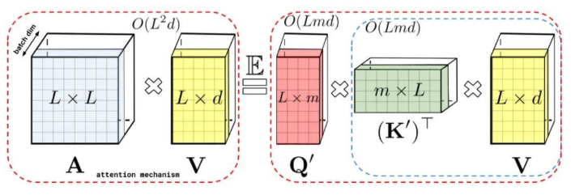

# 【关于 Performer 】 那些你不知道的事

> 作者：杨夕 
> 项目地址：https://github.com/km1994/nlp_paper_study 
> 论文：RETHINKING ATTENTION  WITH PERFORMERS 
> 论文地址：chrome-extension://ikhdkkncnoglghljlkmcimlnlhkeamad/pdf-viewer/web/viewer.html?file=https%3A%2F%2Farxiv.org%2Fpdf%2F2009.14794.pdf 
> 论文github：https://github.com/google-research/google-research/tree/master/performer 
> 个人介绍：大佬们好，我叫杨夕，该项目主要是本人在研读顶会论文和复现经典论文过程中，所见、所思、所想、所闻，可能存在一些理解错误，希望大佬们多多指正。 

## 前言

- Transformer 问题 ：有着巨大的内存和算力需求，因为它构造了一个注意力矩阵，需求与输入呈平方关系
- Performer 模型因为随机正正交特性为注意力矩阵构建了一个无偏的估计量，可以获得线性增长的资源需求量。

## 动机

- Transformer:
  - 核心：注意力模块
  - 思路：计算输入序列中所有位置对的相似度得分
  - 问题：随着输入序列长度的增加，注意力机制本身的问题也越来越突出，因为它需要二次方的计算时间来产生所有的相似度得分，用来存储这些得分的内存大小也是如此
- 改进方法：稀疏注意力
  - 优点：速度快、空间利用率高
  - 局限性：
    - 首先，它们需要高效的稀疏矩阵乘法运算，但这并不是所有加速器都能做到的；
    - 其次，它们通常不能为自己的表示能力提供严格的理论保证；
    - 再者，它们主要针对 Transformer 模型和生成预训练进行优化；
    - 最后，它们通常会堆更多的注意力层来补偿稀疏表示，这使其很难与其他预训练好的模型一起使用，需要重新训练，消耗大量能源。

## 方法介绍

- Performer 
  - 方法：使用一个高效的（线性）广义注意力框架（generalized attention framework），允许基于不同相似性度量（核）的一类广泛的注意力机制。
  - 该框架通过谷歌的新算法 FAVOR+（ Fast Attention Via Positive Orthogonal Random Features）【能够提供注意力机制的可扩展低方差、无偏估计，这可以通过随机特征图分解（常规 softmax-attention）来表达】来实现。
  - 优点：该方法在保持线性空间和时间复杂度的同时准确率也很有保证，也可以应用到独立的 softmax 运算。此外，该方法还可以和可逆层等其他技术进行互操作。

### 广义的注意力机制

- 以往的注意力机制：  
  - 分别对应矩阵行与列的 query 和 key 输入相乘，通过 softmax 计算形成一个注意力矩阵，以存储相似度系数。
  - 问题：不能将 query-key 生成结果传递给非线性 softmax 计算之后再将其分解为原始的 query 和 key。【将注意力矩阵分解为原始 query 和 key 的随机非线性函数的乘积是可以的，即所谓的随机特征（random feature），这样就可以更加高效地对相似度信息进行编码。】

- 广义注意力（generalized attention）：
  - 思路：首先实现一些更广义的非线性函数，隐式定义 query-key 结果中其他类型的相似性度量或核函数

### 新算法 FAVOR+：通过矩阵相关性实现快速注意力

- 思路：
  - 上文描述的分解允许我们以线性而非二次内存复杂度的方式存储隐式注意力矩阵；
  - 还可以通过分解获得一个线性时间注意力机制。虽然在分解注意力矩阵之后，原始注意力机制与具有值输入的存储注意力矩阵相乘以获得最终结果，我们可以重新排列矩阵乘法以近似常规注意力机制的结果，并且不需要显式地构建二次方大小的注意力矩阵。

> 左：标准注意力模块计算，其中通过执行带有矩阵 A 和值张量 V 的矩阵乘法来计算最终的预期结果； 
> 右：通过解耦低秩分解 A 中使用的矩阵 Q′和 K′以及按照虚线框中指示的顺序执行矩阵乘法，研究者获得了一个线性注意力矩阵，同时不用显式地构建 A 或其近似。

上述分析与双向注意力（即非因果注意力）相关，其中没有 past 和 future 的概念。对于输入序列中没有注意前后 token 的单向（即因果）注意力而言，研究者稍微修改方法以使用前缀和计算（prefix-sum computation），它们只存储矩阵计算的运行总数，而不存储显式的下三角常规注意力矩阵。

> 左：标准单向注意力需要 mask 注意力矩阵以获得其下三角部分； 
> 右：LHS 上的无偏近似可以通过前缀和获得，其中用于 key 和值向量的随机特征图的外积（outer-product）前缀和实现动态构建，并通过 query 随机特征向量进行左乘计算，以在最终矩阵中获得新行（new row）。

## 参考

1. [自己挖坑自己填，谷歌大改Transformer注意力，速度、内存利用率都提上去了](https://zhuanlan.zhihu.com/p/269751265)