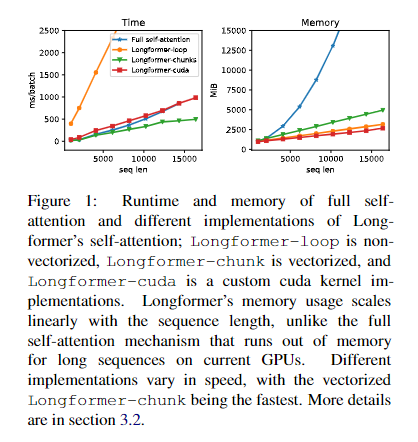
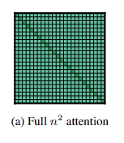
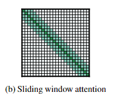
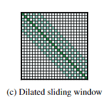
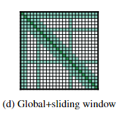
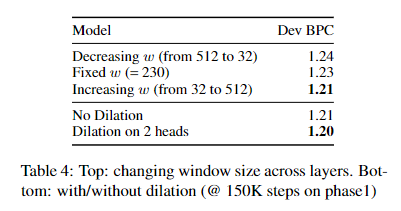

# 【关于 Longformer】 那些的你不知道的事

> 作者：杨夕
> 
> 项目地址：https://github.com/km1994/nlp_paper_study
> 
> NLP 面经地址：https://github.com/km1994/NLP-Interview-Notes
> 
> 个人介绍：大佬们好，我叫杨夕，该项目主要是本人在研读顶会论文和复现经典论文过程中，所见、所思、所想、所闻，可能存在一些理解错误，希望大佬们多多指正。
> 
> 论文：Longformer: The Long-Document Transformer
> 
> 发表会议：naacl2021
> 
> 论文地址：https://arxiv.org/abs/2004.05150
> 
> github：https://github.com/allenai/longformer

## 一、摘要

Transformer-based models are unable to process long sequences due to their self-attention operation, which scales quadratically with the sequence length. To address this limitation, we introduce the Longformer with an attention mechanism that scales linearly with sequence length, making it easy to process documents of thousands of tokens or longer. Longformer's attention mechanism is a drop-in replacement for the standard self-attention and combines a local windowed attention with a task motivated global attention. Following prior work on long-sequence transformers, we evaluate Longformer on character-level language modeling and achieve state-of-the-art results on text8 and enwik8. In contrast to most prior work, we also pretrain Longformer and finetune it on a variety of downstream tasks. Our pretrained Longformer consistently outperforms RoBERTa on long document tasks and sets new state-of-the-art results on WikiHop and TriviaQA. We finally introduce the Longformer-Encoder-Decoder (LED), a Longformer variant for supporting long document generative sequence-to-sequence tasks, and demonstrate its effectiveness on the arXiv summarization dataset.

- 动机：基于 Transformer 的模型无法处理长序列，因为它们的 self-attention 操作与序列长度成二次方关系。
- 论文方法：引入了具有注意机制的 Longformer，该机制随序列长度线性缩放，从而可以轻松处理数千个标记或更长的文档。 Longformer 的注意力机制是标准 self-attention 的替代品，它将局部窗口注意力与任务驱动的全局注意力相结合。
- 实验结果：预训练的 Longformer 在长文档任务上的表现始终优于 RoBERTa，并在 WikiHop 和 TriviaQA 上创造了新的最先进的结果。我们最后介绍了 Longformer-Encoder-Decoder (LED)，这是一种用于支持长文档生成序列到序列任务的 Longformer 变体，并证明了它在 arXiv 汇总数据集上的有效性。

## 二、动机

- 基于传统Transformer的模型，因为 每一个token都要与其他所有token进行交互，其**self-attention的点积计算量都是 O(n^2)** ，(其中 n 为输入序列长度)，因此对于长序列的处理存在内存瓶颈（self-attention的计算可以并行化，所以时间复杂度仍然是 O(n) ）。这也是传统Transformer模型把输入长度限制在512个token以内的原因之一。
- 在面对超过长度限制的长文档时，往往需要**进行切片、截断或者抽取重要片段等处理**，这种做法 导致不同的text span之间无法进行交互，因而必然存在大量information loss，**既繁琐又破坏了原始文本的完整性**。
- 通过添加一些其他机制来加强这种text span之间的交互。但这种新增机制实现起来通常比较复杂，而且往往是task-specific的，通用性不强

## 三‘论文方法

对于每一个token，**只对固定窗口大小的附近token计算local attention**，并结合具体任务，**计算少量的global attention**。该方法的优点包括：

- 复杂度低，将attention机制的复杂度降至 O(n)
- 通用性强，可用于各类文档级任务
- 部署容易，作者在cuda内核上直接实现了Longformer的attention pattern，并提供了开源代码。

- 论文亮点：Longformer的提出就是为了解决这个问题，它**使用滑动窗口注意力（Sliding Window Attention）来代替self-attention**，再**结合task-specific的全局注意力（Global Attention）作为补充**。

> 上图展现了传统Transformer中注意力计算的内存占用随着输入序列长度的增大呈平方上升（右图紫色），而Longformer在长序列处理中具有显著存储优势（右图红色）的同时，处理速度的下降微乎其微（左图红色）。
> 图中作为baseline的Full self-attention就是传统Transformer 中的自注意力；Longformer采用了Naive Pytorch和TVM两种实现方式。Naive Pytorch和Longformer的区别在于：Longformer的实现采用TVM技术将计算自注意力的代码编译为CUDA核，将处理速度提高了6倍左右（左图青色和红色）。
> 
## 四、模型介绍

### 4.1 Full Attention

> 传统Transformer中的Self-attention，对序列中每一对token都计算注意力，所以**注意力占用的存储量随序列长度平方增长**。

### 4.2 滑窗机制 (Sliding window attention)

对于每一个 token，**只对其附近的 w 个 token 计算 attention，时间复杂度为 O(n*w)**，其中 n 为文本的长度。作者认为，根据应用任务的不同，可以对 Transformer 每一层施以不同的窗口大小 w 

> 读到这里，大家可能和我一样，误认为这个窗口 w 的值比较小，估计在 8-64 的量级。但看到实验部分会发现，作者在具体实现的时候，设置的窗口大小 w=512，与 BERT 的 input 限制完全一样，所以大家不要存有 "Longformer 比 BERT 更轻量" 的错觉

### 4.3 空洞滑窗机制 (Dilated sliding window)

对每一个 token 进行编码时，普通的滑窗机制只能考虑到长度为 w 的上下文。作者进一步提出空洞滑窗机制（实际上空洞滑窗是 CV 领域中很早就有的一项技术），在不增加计算负荷的前提下，拓宽视野范围。在滑动窗口中，被 attented 到的两个相邻 token 之间会存在大小为 d 的间隙，因此每个 token 的视野范围可达到 d*w。实验表明，由于考虑了更加全面的上下文信息，空洞滑窗机制比普通的滑窗机制表现更佳

### 4.4 融合全局信息的滑窗机制 (Global+sliding window)

我们知道 BERT 类的语言模型在 fine-tune 时，实现方式略有不同。

> 比如，对于文本分类任务，我们会在整个输入的前面加上 [CLS] 这个 token；而对于 QA 任务，我们则会将问题与文本进行拼接后进行输入。

在 Longformer 中，作者也希望能够根据具体任务的不同，**在原本 local attention 的基础上添加少量的 global attention**。

> 例如，在分类任务中会在 [CLS] 初添加一个 global attention（对应图第一行第一列全绿）；而在 QA 任务上会对 question 中的所有 token 添加 global attention。如图所示，对于添加了 global attention 的 token，我们对其编码时要对整个序列做 attention，并且编码其它 token 时，也都要 attend 到它

## 五、实验结果

## 参考

1. [Longformer阅读笔记](https://zhuanlan.zhihu.com/p/150509736)
2. [Longformer 详解](https://wmathor.com/index.php/archives/1509/)
3. [《Longformer: The Long-Document Transformer》论文笔记](https://zhuanlan.zhihu.com/p/134748587)
4. [Longformer：超越RoBERTa，为长文档而生的预训练模型_夕小瑶的卖萌屋-程序员秘密](https://www.cxymm.net/article/xixiaoyaoww/107398795)
